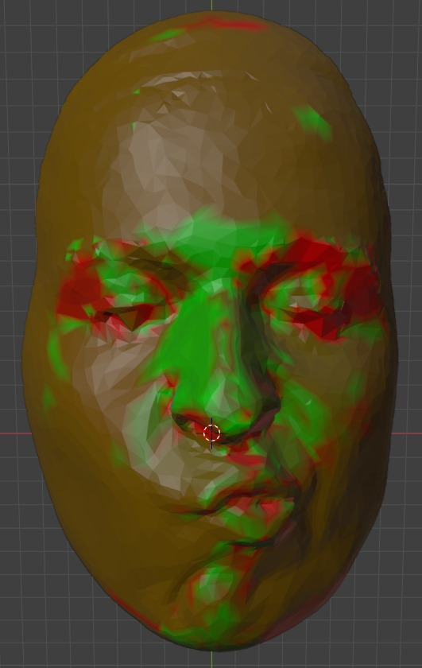

# TDA Final Project (CS434) Fall 2024

This is an algorithm that attempts to segment a 3D model of a human face by comparing vertex normals and mean and Gaussian curvature at each vertex (work in progress). 

## Getting started

1. Run dataprep.py on your .obj file
2. Run main.py
3. Run toply.ply on your newly outputted .obj file
4. Import .ply file into Blender, add new Material, and set Base Color to Color Attribute to view in Render mode
5. Run extractcolors.py on your desired .ply file
6. Run createPDs.py on your desired .ply files and reference .obj file

